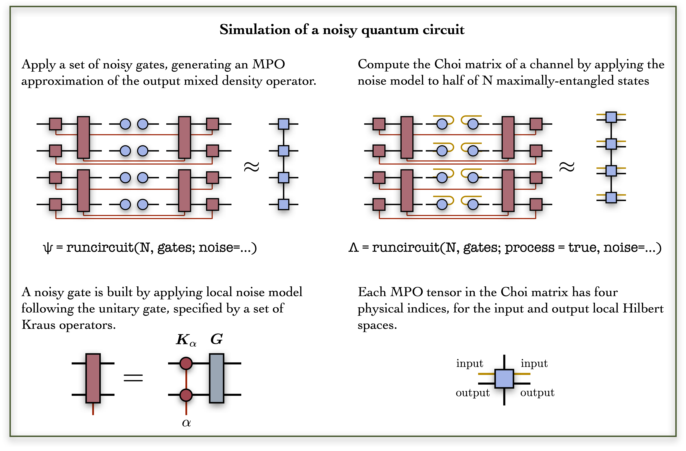
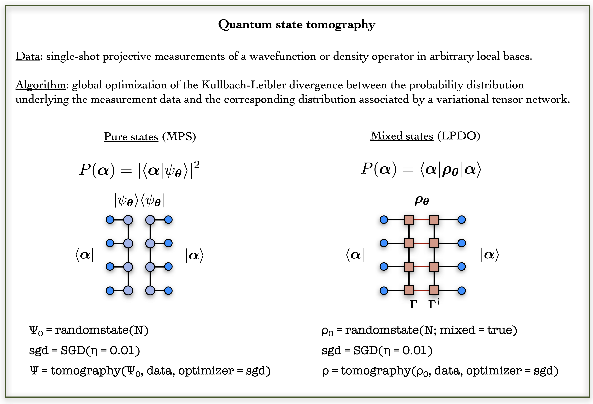

[](https://github.com/GTorlai/PastaQ.jl/actions?query=workflow%3ATests)
<!---
[](https://codecov.io/gh/GTorlai/PastaQ.jl)
[](https://gtorlai.github.io/PastaQ.jl/stable/)
-->
[](https://gtorlai.github.io/PastaQ.jl/dev/)
[](https://opensource.org/licenses/Apache-2.0)
[](https://arxiv.org/abs/)

PLEASE NOTE THIS IS PRE-RELEASE SOFTWARE      

EXPECT ROUGH EDGES AND BACKWARD INCOMPATIBLE UPDATES

# A Package for Simulation, Tomography and Analysis of Quantum Computers

PastaQ is a julia package for simulation and benchmarking of quantum computers using a combination
of machine learning and tensor-network algorithms.

The main features of PastaQ are:
+ **Simulation of quantum circuits**. The package provides a simulator based on Matrix Product States (MPS) to simulate quantum circuits compiled into a set of quantum gates. Noisy circuits are simulated by specifying a noise model of interest, which is applied to each quantum gate.
+ **Quantum state tomography**. Data-driven reconstruction of an unknown quantum wavefunction or density operators, learned respectively with an MPS and a Locally-Purified Density Operator (LPDO). The reconstruction can be certified by fidelity measurements with the target quantum state (if known, and if it admits an efficient tensor-network representation).
+ **Quantum process tomography**. Data-driven reconstruction of an unknown quantum channel, characterized in terms of its Choi matrix (using a similar approach to quantum state tomography). The channel can be unitary (i.e. rank-1 Choi matrix) or noisy.

PastaQ is developed at the Center for Computational Quantum Physics of the Flatiron Institute,
and it is supported by the Simons Foundation.

## Installation
The PastaQ package can be installed with the Julia package manager. From the Julia REPL,
type ] to enter the Pkg REPL mode and run:

```
~ julia
```

```julia
julia> ]

pkg> add https://github.com/GTorlai/PastaQ.jl
```

Please note that right now, PastaQ.jl requires that you use Julia v1.4 or later.

## Documentation

<!---
- [**STABLE**](https://gtorlai.github.io/PastaQ.jl/stable/) --  **documentation of the most recently tagged version.**
-->
- [**DEVEL**](https://gtorlai.github.io/PastaQ.jl/dev/) -- *documentation of the in-development version.*

## Code Overview
The algorithms implemented in PastaQ rely on a tensor-network representation of
quantum states, quantum circuits and quantum channels, which is provided by the
ITensor package.

### Simulation of quantum circuits
A quantum circuit is built out of a collection of elementary quantum gates. In
PastaQ, a quantum gate is described by a data structure `g = ("gatename",sites,params)`
consisting of a `gatename` string identifying a particular gate, a set of `sites`
identifying which qubits the gate acts on, and a set of gate parameters `params`
(e.g. angles of qubit rotations). A comprehensive set of gates is provided,
including Pauli matrices, phase and T gates, single-qubit rotations, controlled
gates, Toffoli gate and others. Additional user-specific gates can be added. Once
a set of gates is specified, the output quantum state (represented as an MPS) is
obtained with the `runcircuit` function.

```julia
using PastaQ

N = 4   # Number of qubits

# Building a circuit data-structure
gates = [("X" , 1),                        # Pauli X on qubit 1
         ("CX", (1, 3)),                   # Controlled-X on qubits [1,3]
         ("Rx", 2, (θ=0.5,)),              # Rotation of θ around X
         ("Rn", 3, (θ=0.5, ϕ=0.2, λ=1.2)), # Arbitrary rotation with angles (θ,ϕ,λ)
         ("√SWAP", (3, 4)),                # Sqrt Swap on qubits [2,3]
         ("T" , 4)]                        # T gate on qubit 4

# Returns the MPS at the output of the quantum circuit: `|ψ⟩ = Û|0,0,…,0⟩`
# First the gate ("X" , 1) is applied, then ("CX", (1, 3)), etc.
ψ = runcircuit(N, gates)
# This is equivalent to:
# julia> ψ0 = qubits(N) # Initialize |ψ⟩ to |0,0,…⟩
# julia> ψ = runcircuit(ψ0,gates) # Run the circuit
```

The unitary circuit can be approximated by a MPO, running the `runcircuit`
function with the flag `process=true`. Below is an example for a random
quantum circuit.


```julia
using PastaQ

# Example 1a: random quantum circuit

N = 4     # Number of qubits
depth = 4 # Depth of the circuit

# Generate a random quantum circuit built out of layers of single-qubit random
# rotations + CX gates, alternating between even and of odd layers.
gates = randomcircuit(N, depth)

@show gates

# Returns the MPS at the output of the quantum circuit: `|ψ⟩ = Û|0,0,…,0⟩`
ψ = runcircuit(N, gates)

# Generate the MPO for the unitary circuit:
U = runcircuit(N, gates; process=true)
```

#### Noisy gates

If a noise model is provided, a local noise channel is applied after each quantum
gate. A noise model is described by a string identifying a set of
Kraus operators, which can depend on a set of additional parameters. The `runcircuit`
function in this setting returns the MPO for the output mixed density operator.
The full quantum channel has several (and equivalent) mathematical representations.
Here we focus on the Choi matrix, which is obtained by applying a given channel `ε`
to half of N pairs of maximally entangled states.



```julia
using PastaQ

# Example 1b: noisy quantum circuit

N = 4     # Number of qubits
depth = 4 # Depth of the quantum circuit
gates = randomcircuit(N, depth) # random circuit

# Run the circuit using an amplitude damping channel with decay rate `γ=0.01`.
# Returns the MPO for the mixed density operator `ρ = ε(|0,0,…⟩⟨0,0,̇…|), where
# `ε` is the quantum channel.
ρ = runcircuit(N, gates; noise = ("amplitude_damping", (γ = 0.01,)))

# Compute the Choi matrix of the channel
Λ = runcircuit(N, gates; process = true, noise = ("amplitude_damping", (γ = 0.01,)))
```

### Generation of projective measurements
For a given quantum circuit, with or without noise, different flavors of measurement
data can be obtained with the function `getsamples(...)` If one is interested in
the quantum state at the output of the circuit, the function carries out a set of
projective measurements in arbitrary local bases. By default, each qubit is measured
randomly in the bases corresponding to the Pauli matrices. The output quantum state,
given as an MPS wavefunction or MPO density operators for unitary and noisy circuits
respectively, is also returned with the data.

```julia
using PastaQ

# Example 2: generation of measurement data

# Set parameters
N = 4                           # Number of qubits
depth = 4                       # Depth of random circuit
nshots = 1000                   # Number of measurements
gates = randomcircuit(N, depth) # Build gates


# 2a) Output state of a noiseless circuit. By default, each projective measurement
# is taken in basis randomly drawn from the the Pauli group. Also returns the output MPS.
data, ψ = getsamples(N, gates, nshots)

#  Note: the above is equivalent to:
# > bases = randombases(N, nshots; local_basis = ["X","Y","Z"])
# > ψ = runcircuit(N, gates)
# > data = getsamples(ψ, bases)

# 2b) Output state of a noisy circuit. Also returns the output MPO
data, ρ = getsamples(N, gates, nshots; noise = ("amplitude_damping", (γ = 0.01,)))
```

For quantum process tomography of a unitary or noisy circuit, the measurement data
consists of pairs of input and output states to the channel. Each input state is a
product state of random single-qubit states. Be default, these are set to the six
eigenstates of the Pauli matrices (an overcomplete basis). The output states are
projective measurements for a set of different local bases. It returns the MPO
unitary circuit (noiseless) or the Choi matrix (noisy).

```julia
# 2c) Generate data for quantum process tomography, consisting of input states
# to a quantum channel, and the corresponding projective measurements
# at the output. By defaul, the states prepared at the inputs are selected from
# product states of eigenstates of Pauli operators, while measurements bases are
# sampled from the Pauli group.

# Unitary channel, returns the MPO unitary circuit
data, U = getsamples(N, gates, nshots; process=true)

# Noisy channel, returns the Choi matrix
data, Λ = getsamples(N, gates, nshots; process = true, noise = ("amplitude_damping", (γ = 0.01,)))
```


#### State tomography
Quantum state tomography consists of reconstructing an unknown quantum state
underlying a set of measurement data. The ingredients for state tomography are a
variational quantum state, a data-driven reconstruction algorithm and an optimization
routine. In PastaQ, the variational quantum states provided are an MPS and an LPDO,
for the reconstruction of a pure quantum wavefunction and a mixed density operator
respectively. The reconstruction algorithm is based on unsupervised machine learning of probability
distributions. A widely used approach consists of optimizing a model distribution by
minimizing the Kullbach-Leibler (KL) divergence between the model and the unknown target distribution,
which is approximated by the training data. For quantum states, the measurement data
is made of projective measurements in arbitrary local bases, and the model probability
distribution is obtained by contracting the variational tensor network with a set of
projectors corresponding to the eigenstates of the observed measurement outcome.

Given a set of training data, the first step is the definition of the quantum state
to be optimized. A random wavefunction or density operator is built using the function
`randomstate(N)` and the appropriate flag `mixed`. Next, one defines a specific optimizer
to be used in reconstruction, such as Stochastic Gradient Descent (SGD). Quantum state tomography
is carried out by calling the function `tomography`, with inputs the initial starting state `ψ0`,
the training data set `data`, and the optimizer `opt`. Additional inputs include the number of
training iterations (`epochs`), the number of samples used for a single gradient update (`batch_size`), as well as
the target quantum state (`target`) if available. During the training, the cost function
is printed, as well as the fidelity against the target quantum state, if `target` is provided.



```julia
using PastaQ

# Load the training data, as well as the target quantum state from file.
data, target = loadsamples("PATH_TO_DATAFILE.h5")
N = size(data, 2) # Number of qubits

# 1. Reconstruction with a variational wavefunction:
#
# Initialize a variational MPS with bond dimension χ = 10.
ψ0 = randomstate(N; χ = 10)

# Initialize stochastic gradient descent with learning rate η = 0.01
opt = SGD(η = 0.01)

# Run quantum state tomography
ψ = tomography(data, ψ0; optimizer = opt, target = target)

# 2. Reconstruction with a variational density matrix:
#
# Initialize a variational LPDO with bond dimension χ = 10 and Kraus dimension ξ = 2.
ρ0 = randomstate(N; mixed = true, χ = 10, ξ = 2)

# Run quantum state tomography
ρ = tomography(data, ρ0; optimizer = opt, target = target)
```

#### Process tomography
In quantum process tomography, the object being reconstructed is a quantum channel `ε`,
fully specified by its Choi matrix `Λ` (defined over `2N` qubits). In practice,
process tomography reduces to quantum state tomography of the Choi matrix, where the training
data consists of input states to the channel, and output projective measurements.
For the special case of a unitary (noiseless) channel `U`, the Choi matrix has rank-1 and is
equivalent to a pure state obtained by being the legs of the unitary operator `U`.


```julia
using PastaQ

# Load the training data, as well as the target quantum state from file.
data, target = loadsamples("PATH_TO_DATAFILE.h5")
N = size(data, 2) # Number of qubits

# 1. Reconstruction with a variational MPO:
#
# Initialize a variational MPO with bond dimension χ = 10.
U0 = randomprocess(N; χ = 10)

# Initialize stochastic gradient descent with learning rate η = 0.01
opt = SGD(η = 0.01)

# Run quantum state tomography
U = tomography(data, U0; optimizer = opt, target = target)

# 2. Reconstruction with a variational density matrix:
#
# Initialize a variational LPDO with bond dimension χ = 10 and Kraus dimension ξ = 2.
Λ0 = randomprocess(N; mixed = true, χ = 10, ξ = 2)

# Run quantum state tomography
Λ = tomography(data, Λ0; optimizer = opt, target = target)
```
