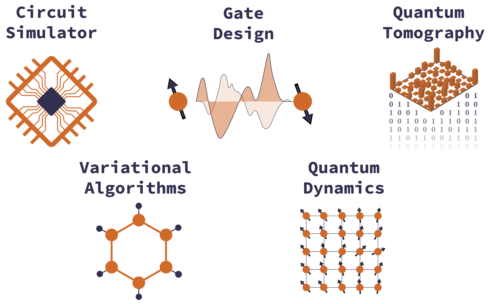

[](https://github.com/GTorlai/PastaQ.jl/actions?query=workflow%3ATests)
[](https://codecov.io/gh/GTorlai/PastaQ.jl)
[](https://gtorlai.github.io/PastaQ.jl/stable/)
[](https://gtorlai.github.io/PastaQ.jl/dev/)
[](https://opensource.org/licenses/Apache-2.0)
[](https://www.pastaq.org/)
[](https://arxiv.org/abs/)

PLEASE NOTE THIS IS PRE-RELEASE SOFTWARE

# PastaQ.jl: design and benchmarking quantum hardware
PastaQ.jl is a Julia software toolbox providing a range of computational methods for quantum computing applications. Some examples are the simulation of quancum circuits, the design of quantum gates, noise characterization and performance benchmarking. PastaQ relies on tensor-network representations of quantum states and processes, and borrows well-refined techniques from the field of machine learning and data science, such as probabilistic modeling and automatic differentiation.



---
## Install
The PastaQ package can be installed with the Julia package manager. From the Julia REPL, type ] to enter the Pkg REPL mode and run:

```julia
julia> ]

pkg> add PastaQ
```

PastaQ.jl relies on the following packages: [ITensors.jl](https://github.com/ITensor/ITensors.jl) for low-level tensor-network algorithms, [Optimisers.jl](https://github.com/FluxML/Optimisers.jl) for stochastic optimization methods, [Zygote.jl](https://github.com/FluxML/Zygote.jl) for automatic differentiation, and [Observers.jl](https://github.com/GTorlai/Observers.jl) for tracking/recording metrics and observables. Please note that right now, PastaQ.jl requires that you use Julia v1.6 or later. 

---


## Documentation

- [**STABLE**](https://gtorlai.github.io/PastaQ.jl/stable/) --  **documentation of the most recently tagged version.**
- [**DEVEL**](https://gtorlai.github.io/PastaQ.jl/dev/) -- *documentation of the in-development version.*

## Examples
We briefly showcase some of the functionalities provided by PastaQ.jl. For more in-depth discussion, please refer to the tutorials folder.


#### Simulating quantum circuits
The vast majority of tasks related to designing and benchmarking quantum computers relies on the capability of simulating quantum circuits, built out of a collection of elementary quantum gates. In PastaQ, a quantum gates is described by a data structure `g = ("gatename", support, params)`, consisting of a gate identifier `gatename` (a `String`), a `support` (an `Int` for single-qubit gates or a `Tuple` for multi-qubit gates), and a set of gate parameters, such as rotations angles, whenever needed. A comprehensive set of elementary gates is provided, including Pauli operations, phase and T gates, single-qubit rotations, controlled gates, Toffoli gate and others. Additional user-specific gates can be easily added to this collection. Once a circuit is defined, it can be executed using the `runcircuit` function:

```julia
using PastaQ

# a quantum circuit in PastaQ
gates = [("X" , 1),                              # Pauli X on qubit 1
         ("CX", (1, 3)),                         # Controlled-X on qubits [1,3]
         ("Rx", 2, (θ = 0.5,)),                  # Rotation of θ around X
         ("Rn", 3, (θ = 0.5, ϕ = 0.2, λ = 1.2)), # Arbitrary rotation with angles (θ,ϕ,λ)
         ("√SWAP", (3, 4)),                      # Sqrt Swap on qubits [2,3]
         ("T" , 4)]                              # T gate on qubit 4
         
# run the circuit
ψ = runcircuit(gates)
# returns the MPS at the output of the quantum circuit: `|ψ⟩ = Û|0,0,…,0⟩`
# first the gate ("X" , 1) is applied, then ("CX", (1, 3)), etc.

# ------------------------------------------------------------------
# Output:
#  ITensors.MPS
#  [1] ((dim=2|id=456|"Qubit,Site,n=1"), (dim=1|id=760|"Link,n=1"))
#  [2] ((dim=1|id=760|"Link,n=1"), (dim=2|id=613|"Qubit,Site,n=2"), (dim=1|id=362|"Link,n=1"))
#  [3] ((dim=2|id=9|"Qubit,Site,n=3"), (dim=2|id=357|"Link,n=1"), (dim=1|id=362|"Link,n=1"))
#  [4] ((dim=2|id=980|"Qubit,Site,n=4"), (dim=2|id=357|"Link,n=1"))
``` 

In this next example, we create a circuit to prepare the GHZ state, and sample projective measurements in the computational basis. We then execture the circuit in the presence of noise, where a local noise channel is applied to each gate. A noise model is described as `noisemodel = ("noisename", (noiseparams...))`, in which case it is applied to each gate identically. To distinguish between one- and two-qubit gates, for example, the following syntax can be used: `noisemodel = (1 => noise1, 2 => noise2)`. For more sophisticated noise models (such as gate-dependent noise), please refer to the documentation. 

```julia
using PastaQ
using ITensors

# number of qubits
n = 20

# manually create a circuit to prepare GHZ state,
# or use built-in call `circuit = ghz(n)` 
circuit = Tuple[("H", 1)]
for j in 1:n-1
  push!(circuit, ("CX", (j, j+1)))
end

# run the circuit to obtain the output MPS
hilbert = qubits(n)
ψ = runcircuit(hilbert, circuit)


# sample projective measurements in the computational basis
@show getsamples(ψ, 5)

# define a noise model with different error rates for
# one- and two-qubit gates
noisemodel = (1 => ("depolarizing", (p = 0.01,)), 
              2 => ("depolarizing", (p = 0.05,)))

# run a noisy circuit
ρ = runcircuit(hilbert, circuit; noise = noisemodel)
@show fidelity(ψ, ρ)
@show getsamples(ρ, 5)

# quantum processes can also be obtained.
# unitary MPO
U = runcircuit(circuit; process = true)
# Choi matrix
Λ = runcircuit(circuit; process = true, noise = noisemodel)

# ------------------------------------------------------------------
# Output:
#  5×20 Matrix{Int64}:
#  1  1  1  1  1  1  1  1  1  1  1  1  1  1  1  1  1  1  1  1
#  1  1  1  1  1  1  1  1  1  1  1  1  1  1  1  1  1  1  1  1
#  0  0  0  0  0  0  0  0  0  0  0  0  0  0  0  0  0  0  0  0
#  0  0  0  0  0  0  0  0  0  0  0  0  0  0  0  0  0  0  0  0
#  1  1  1  1  1  1  1  1  1  1  1  1  1  1  1  1  1  1  1  1
# 
#  fidelity(ψ, ρ) = 0.40840853095498975
# 
#  5×20 Matrix{Int64}:
#  1  1  1  1  1  1  0  0  0  0  0  0  1  0  0  0  1  1  1  1
#  1  1  1  0  0  0  0  0  0  0  0  0  0  0  0  0  0  0  0  0
#  0  0  0  0  0  0  0  0  0  0  0  0  0  0  1  1  1  1  1  1
#  0  0  0  0  0  0  0  0  0  0  0  0  1  1  1  1  1  1  1  1
#  1  1  1  1  1  1  1  1  1  1  1  1  1  1  1  1  1  1  1  1
```

There is a number of built-in circuits available, one examples being random circuits. In the following, we generate a one-dimensional random quantum circuits built out with a brick-layer geometry of alternative `CX` gates and layers of random single-qubit rotations:

```julia
n = 100 
depth = 20
circuit = randomcircuit(n; depth = depth, 
                           twoqubitgates = "CX", 
                           onequbitgates = "Rn")
@time ψ = runcircuit(circuit; cutoff = 1e-10)
@show maxlinkdim(ψ)
# ------------------------------------------------------------------
# Output:
#  89.375383 seconds (5.25 M allocations: 64.781 GiB, 9.98% gc time)
#  maxlinkdim(ψ) = 908
```

#### Variational quantum eingensolver


```julia
using ITensors
using PastaQ
using Printf
using OptimKit

N = 10   # number of qubits
J = 1.0  # Ising exchange interaction
h = 0.5  # transverse magnetic field

# Hilbert space
hilbert = qubits(N)

# define the Hamiltonian
os = OpSum()
for j in 1:n-1
  os .+= (-J, "Z",j,"Z",j+1)
  os .+= (-h, "X", j)
end
os .+= (-h, "X",N)

# build MPO "cost function"
H = MPO(os, hilbert)
Edmrg = -9.7655034665
@printf("Exact energy from DMRG: %.8f\n", Edmrg)

# layer of single-qubit Ry gates
Rylayer(N, θ) =
  [("Ry", j, (θ = θ[j],)) for j in 1:N]

# brick-layer of CX gates
CXlayer(N,Π) =
  isodd(Π) ? [("CX", (j, j+1)) for j in 1:2:N-1] :
             [("CX", (j, j+1)) for j in 2:2:N-1]

# variational ansatz
function variationalcircuit(N, depth, θ⃗)
  circuit = Tuple[]
  for d in 1:depth
    circuit = vcat(circuit, CXlayer(N, d))
    circuit = vcat(circuit, Rylayer(N, θ⃗[d]))
  end
  return circuit
end

depth = 20
ψ = productstate(hilbert)

# cost function
function loss(θ⃗)
  circuit = variationalcircuit(N, depth, θ⃗)
  U = buildcircuit(ψ, circuit)
  return inner(H, U, ψ; cutoff = 1e-8)
end

# initialize parameters
θ⃗₀ = [2π .* rand(N) for _ in 1:depth]

# run VQE using BFGS optimization
optimizer = LBFGS(maxiter = 500, verbosity=2)
loss_n_grad(x) = (loss(x), convert(Vector, loss'(x)))
θ⃗, fs, gs, niter, normgradhistory = optimize(loss_n_grad, θ⃗₀,  optimizer)
@printf("Relative error: %.3E", abs(Edmrg - fs[end]) / abs(Edmrg))

# ------------------------------------------------------------------
# Output:
#  Exact energy from DMRG: -9.76550347
# 
#  [ Info: LBFGS: initializing with f = -0.182090597122, ‖∇f‖ = 2.3297e+00
#  [ Info: LBFGS: iter    1: f = -2.157995740330, ‖∇f‖ = 2.4305e+00, α = 1.00e+00, m = 0, nfg = 1
#  [ Info: LBFGS: iter    2: f = -2.397853058857, ‖∇f‖ = 4.5561e+00, α = 1.00e+00, m = 1, nfg = 1
#  [ Info: LBFGS: iter    3: f = -4.141376142741, ‖∇f‖ = 3.0358e+00, α = 1.00e+00, m = 2, nfg = 1
#  [ Info: LBFGS: iter    4: f = -4.850744631864, ‖∇f‖ = 2.7316e+00, α = 1.00e+00, m = 3, nfg = 1
#  [ Info: LBFGS: iter    5: f = -5.522683055280, ‖∇f‖ = 2.3480e+00, α = 1.00e+00, m = 4, nfg = 1
#  ...
#  [ Info: LBFGS: iter  498: f = -9.764686918396, ‖∇f‖ = 9.0752e-04, α = 1.00e+00, m = 8, nfg = 1
#  [ Info: LBFGS: iter  499: f = -9.764687006358, ‖∇f‖ = 1.1905e-03, α = 1.00e+00, m = 8, nfg = 1
#  Relative error: 8.360E-05
```


## Citation
If you use PastaQ.jl in your work, for now please consider citing the Github page:

```
@misc{pastaq,
    title={\mbox{PastaQ}: A Package for Simulation, Tomography and Analysis of Quantum Computers},
    author={Giacomo Torlai and Matthew Fishman},
    year={2020},
    url={https://github.com/GTorlai/PastaQ.jl/}
}
```
